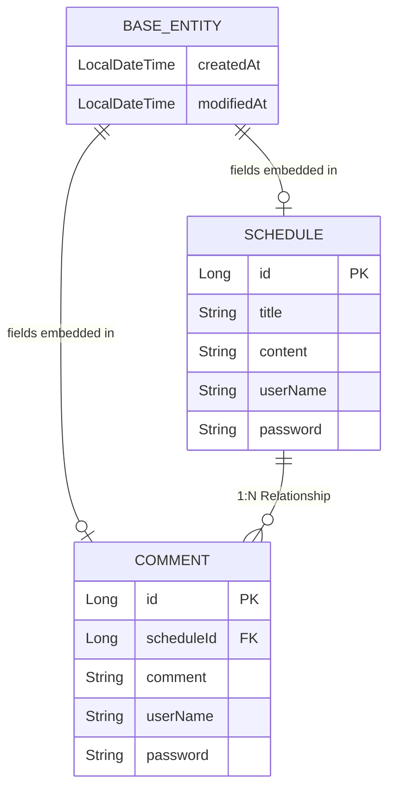

# 🗓️ 일정 관리 앱 만들기
> ⚙️ **사용 기술: Java 17, Spring Boot 4.0.2, Spring Data JPA, MySQL, Git**
<br>

---
## 💻 프로젝트 소개
- 일정 생성, 조회, 수정, 삭제 구현
- 일정에 댓글 생성 구현
- 유저 입력 검증


---
# 🧾 API 명세서
> **공통 URL :** http://localhost:8080<br>
> **Content-Type:** application/json <br>

| Method | 기능 | Path | 상태코드 |
| :--- | :--- | :--- | :--- |
| POST | 일정 등록 | /schedules | 201 Created / 400 Bad Request |
| GET | 일정 전체 조회 | /schedules | 200 OK |
| GET | 일정 단건 조회 | /schedules/{scheduleId} | 200 OK |
| PUT | 일정 수정 | /schedules/{scheduleId} | 200 OK |
| DELETE | 일정 삭제 | /schedules/{scheduleId} | 204 No Content |
| POST | 댓글 등록 (최대 10개) | /schedules/{scheduleId}/comments | 201 Created |

## 일정 생성 (POST)
- **URL:** /schedules

### 상태코드
| 상태코드 | 기능 |
| :--- | :--- |
| 201 Created | 일정 생성 성공 |
| 400 Bad Request | 일정 생성 실패 |

### Request
```json
{
    "title": "제목",
    "content" : "내용",
    "userName" : "이름",
    "password" : "pass1"
}
```
### Response (200 Created)
```json
{
    "title": "제목",
    "content": "내용",
    "userName": "이름",
    "createdAt": "2026-02-05T03:16:45.2658476",
    "modifiedAt": "2026-02-05T03:16:45.2658476"
}
```

## 전체 일정 조회 (GET)
- **URL:** /schedules/search/이름
### 상태코드
| 상태코드 | 기능 |
| :--- | :--- |
| 200 OK | 일정 조회 성공 |
| 404 Not Found | 이름이 같은 일정이 없음 |

### Response
```json
[
    {
        "id": 2,
        "title": "제목2",
        "content": "내용2",
        "userName": "이름",
        "createdAt": "2026-02-05T03:19:02.105436",
        "modifiedAt": "2026-02-05T03:19:02.105436"
    },
    {
        "id": 1,
        "title": "제목",
        "content": "내용",
        "userName": "이름",
        "createdAt": "2026-02-05T03:16:45.265848",
        "modifiedAt": "2026-02-05T03:16:45.265848"
    }
]
```

## 선택 일정 조회 (GET)
- **URL:** /schedules/1
### 상태코드
| 상태코드 | 기능 |
| :--- | :--- |
| 200 OK | 일정 조회 성공 |

### Response (200 OK)
```json
{
    "id": 1,
    "title": "수정한 제목",
    "content": "내용",
    "userName": "수정한 이름",
    "createdAt": "2026-02-05T03:16:45.265848",
    "modifiedAt": "2026-02-05T03:20:04.554564",
    "getCommentList": [
        {
            "id": 1,
            "comment": "댓글 내용",
            "userName": "이름",
            "createdAt": "2026-02-05T03:22:06.319406",
            "modifiedAt": "2026-02-05T03:22:06.319406"
        },
        {
            "id": 2,
            "comment": "댓글 내용2",
            "userName": "이름",
            "createdAt": "2026-02-05T03:22:20.016526",
            "modifiedAt": "2026-02-05T03:22:20.016526"
        }
    ]
}
```


## 일정 수정 (PUT)
- **URL:** /schedules/1
### 상태코드
| 상태코드 | 기능 |
| :--- | :--- |
| 200 OK | 일정 수정 성공 |
| 404 Not Found | 제목 / 이름 없음 (일정 수정 실패) |

### Request
```json
{
    "title": "수정한 제목",
    "userName" : "수정한 이름",
    "password" : "pass1"
}
```
### Response (200 OK)
```json
{
    "id": 1,
    "title": "수정한 제목",
    "content": "내용",
    "userName": "수정한 이름",
    "modifiedAt": "2026-02-05T03:16:45.265848"
}
```

## 일정 삭제 (DELETE)
- **URL:** /schedules/2
### 상태코드
| 상태코드 | 기능 |
| :--- | :--- |
| 204 No Content | 일정 삭제 성공 |

### Request
```json
{
    "password" : "pass1"
}
```
### Response (204 No Content)
## 댓글 생성 (POST)
- **URL:** /schedules/1/comments
### 상태코드
| 상태코드 | 기능 |
| :--- | :--- |
| 201 Created | 댓글 생성 성공 |
| 404 Not Found | 댓글이나 이름이 없음 (댓글 생성 실패) |

### Request
```json
{
    "comment" : "댓글 내용",
    "userName" : "이름",
    "password" : "pass1"
}
```
### Response
```json
{
    "comment": "댓글 내용",
    "userName": "이름",
    "createdAt": "2026-02-05T03:22:20.0165263",
    "modifiedAt": "2026-02-05T03:22:20.0165263"
}
```

---
# 🔗 POSTMAN API 명세서
> https://documenter.getpostman.com/view/26831144/2sBXc7MQco
<br>

---

# ERD
 <br>

